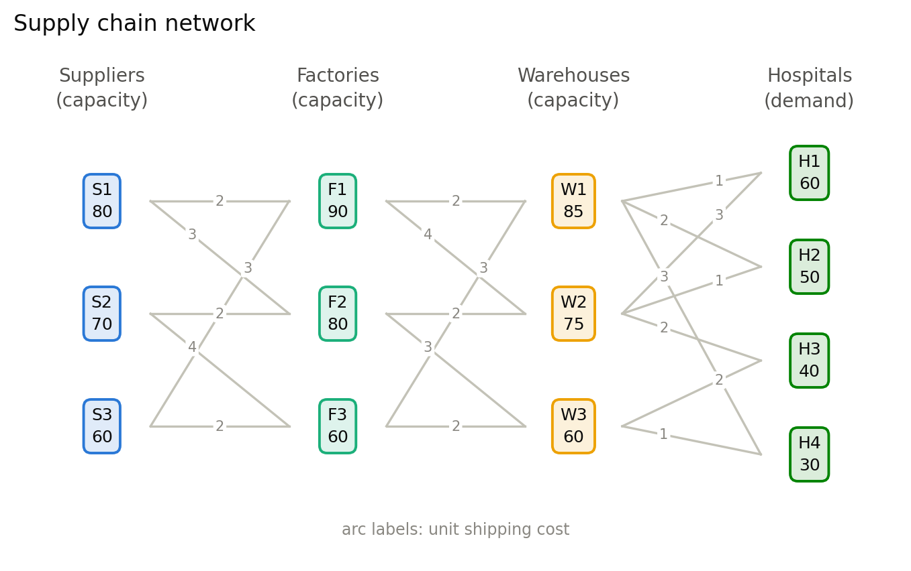
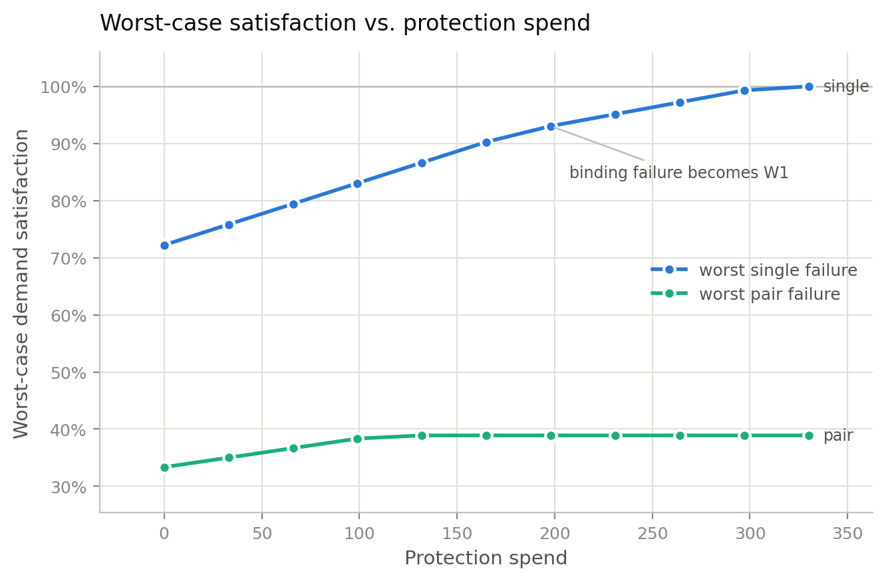
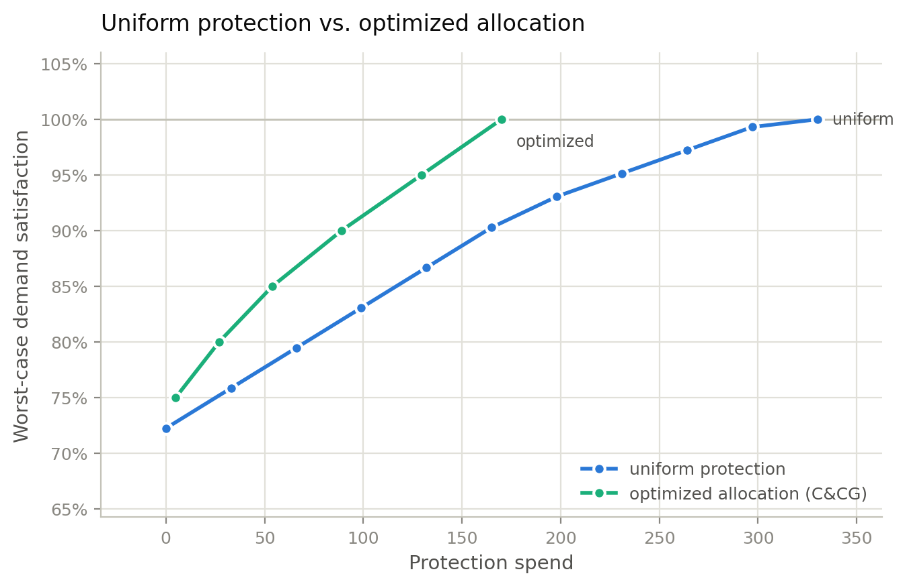
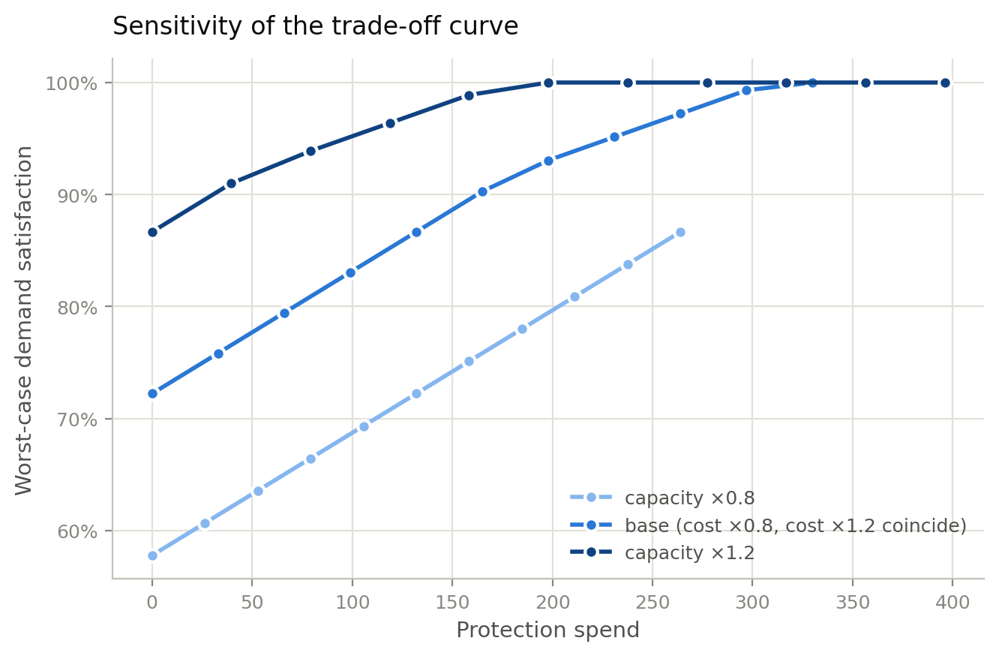

# Pharmaceutical Supply Chain Resilience under Network Disruptions: A Computational Study of the Cost–Resilience Trade-off in a Four-Tier Pharmaceutical Network

## Abstract

This paper provides a computational study of the cost–resilience trade-off in
a four-tier pharmaceutical supply chain network under disruptions. The model
computes the pre-disruption protection budget needed to ensure worst-case
delivery in the event of disruptions, compares uniform protection to the
protection optimized using two-stage robust optimization, and validates the
column-and-constraint generation (C&CG) algorithm using exhaustive enumeration
of all scenarios.

## Contents

- [Overview](#overview)
- [Research question](#research-question)
- [Network instance](#network-instance)
- [Mathematical model](#mathematical-model)
- [Disruption model](#disruption-model)
- [Protection models](#protection-models)
- [Column-and-constraint generation](#column-and-constraint-generation)
- [Metrics](#metrics)
- [Results](#results)
- [Sensitivity analysis](#sensitivity-analysis)
- [Limitations and scope](#limitations-and-scope)
- [Reproducibility](#reproducibility)
- [Repository layout](#repository-layout)
- [References](#references)

## Overview

Contemporary supply chains optimize the cost of routing flow through the least
expensive facilities, thus leaving themselves vulnerable to
single-point-of-failure problems. In pharmaceutical distribution, this may
result in shortages of medicines. Therefore, the question becomes one of
calculating the marginal cost of ensuring worst-case delivery of goods with
every increase in the level of protection.

This paper aims to address this problem precisely for an illustratively small
instance. All failure scenarios are enumerated and solved exhaustively;
therefore, all figures provided represent proven optimality. The exhaustive
framework is also used to validate the column-and-constraint generation (C&CG)
algorithm, which is the standard tool for large networks, impossible to
enumerate.

## Research question

How should a budget of protection be spent to ensure worst-case satisfaction
of demand in a four-tier pharmaceutical supply chain subject to single and
paired facility disruptions, and to what extent is uniform protection
inefficient relative to optimized protection?

## Network instance

The network is an artificial illustrative instance: a directed four-tier graph
with three suppliers, three factories, three warehouses, and four hospitals,
connected by 20 arcs with unit shipping costs of 1 to 4. The network is
calibrated so that total capacity is greater than total demand in every tier
but disruption of any node causes shortages. Thus, the question of resilience
is relevant only in the case of disrupted service.



| Tier | Nodes (capacity or demand) | Tier total |
|------|---------------------------|------------|
| Suppliers | S1: 80, S2: 70, S3: 60 | 210 |
| Factories | F1: 90, F2: 80, F3: 60 | 230 |
| Warehouses | W1: 85, W2: 75, W3: 60 | 220 |
| Hospitals (demand) | H1: 60, H2: 50, H3: 40, H4: 30 | 180 |

Every hospital is reachable from two warehouses; hence, the warehouse tier is
structurally vulnerable: {W1, W2} is the only cut separating hospitals
completely. All the parameters, including the shortage penalty (per unit) and
the protection cost (rate per unit of extra capacity), are stored in a single
file, `src/network.py`.

## Mathematical model

The mathematical core of the problem is the minimum-cost flow model. The model
is formulated as a linear program selecting flows on arcs $x_{ij} \ge 0$ and
unmet demand $s_h \ge 0$ to minimize:

$$
\min \sum_{(i,j)} c_{ij} x_{ij} + P \sum_h s_h
$$

subject to

$$
\sum_j x_{sj} \le u_s \quad \text{for each supplier } s \text{ (supplier capacity constraints)}
$$

$$
\sum_i x_{in} = \sum_j x_{nj} \quad \text{and} \quad \sum_i x_{in} \le u_n \quad \text{for each intermediate node } n \text{ (conservation and capacity)}
$$

$$
\sum_i x_{ih} + s_h = d_h \quad \text{for each hospital } h \text{ (demand with shortage slack)}
$$

The shortage slack makes the problem feasible in disrupted conditions, and the
penalty $P = 1000$ overwhelms shipping costs, thus forcing the solver to
maximize delivery of the physical flow prior to optimizing the cost. Demand
satisfaction is defined as $1 - \sum_h s_h / \sum_h d_h$.

## Disruption model

A disruption sets the capacity of a node to zero, thus excluding it from all
possible flows. The uncertainty set is constrained budget-wise:

- **Single failures**: all nine scenarios (each non-hospital node fails in turn)
- **Pair failures**: all 36 unordered pairs of nodes

For this network size, exhaustive enumeration is both exact and efficient
(approximately 1,100 LP solves for the whole pipeline). The reported
worst-case performance is guaranteed to be the true optimum over the
uncertainty set, not an approximation. For larger networks, enumeration is
computationally impractical, requiring some sort of iterative method; here,
enumeration provides the ground truth against which C&CG is validated.

## Protection models

### Uniform protection sweep

The first policy scales each non-hospital capacity by a factor of $(1 + p)$
for each level of protection $p \in \{0, 0.05, \ldots, 0.50\}$. The spend at
level $p$ is $r \cdot p \cdot \sum_n u_n$ with the protection rate $r = 1$.
All protection levels are assessed against all failure scenarios to create the
cost–resilience curve for uniform protection. Uniform protection is the policy
of adding the same relative capacity anywhere.

### Two-stage robust optimization (optimized allocation)

The second policy allows the model to choose the allocation of capacity. In
the first stage, capacity of each facility is increased by the value of
$e_n \ge 0$ at cost of $r \sum_n e_n$; in the second, flow is rerouted after a
disruption is realized. The knob of resilience is a target of worst-case
satisfaction $\tau \in [0, 1]$; the program minimizes protection spending with
respect to each scenario satisfying the target:

$$
\min_{e \ge 0} \; r \sum_n e_n
\quad \text{s.t.} \quad
\text{satisfaction}_k(e) \ge \tau \;\; \text{for all scenarios } k,
$$

where each scenario constraint includes the whole flow program with capacities
$u_n + e_n$ (or 0 for failed nodes). Since the uncertainty set is finite and
can be enumerated, this is a single linear program. Sweeping $\tau$ gives the
exact cost–resilience frontier.

**Formulation note**: A cost-based objective of the form
$\text{cost} + w \cdot \text{worst-case damage}$, where $w \in [0, 1]$,
degenerates on this instance. The shortage penalty (1000 per unit) is many
times greater than protection costs (1 to 4 per unit); thus, the range of
usable weights collapses to an all-or-nothing decision close to $w = 0.005$.
The target-constraint form produces an interpretable frontier: every point on
the curve indicates the necessary level of expenditure to guarantee some level
of $\tau$.

## Column-and-constraint generation

C&CG (Zeng & Zhao, 2013) computes the same solution by enumeration of a subset
of scenarios:

1. Start with an empty subset of scenarios and 0 protection.
2. **Oracle**: evaluate the current solution against all scenarios to pick the
   most damaging one.
3. If the worst scenario satisfies the target, stop, the solution is optimal.
4. Otherwise, add that scenario to the master problem, re-optimize the
   min-spend LP with the augmented scenario set, and continue.

Convergence is guaranteed by the fact that once a scenario is included in the
problem, it is always satisfied by future solutions; therefore, no scenario is
included more than once. At the tested targets, the iterative solution yields
the same LP spend as the exhaustive solution to the solver tolerance, thus
validating C&CG against enumeration at this network size.

## Metrics

- **Cost**: Objective of the scenario LP (shipping + shortage penalties)
- **Demand satisfaction**: Percent of total demand delivered after disruption
- **Equity**: Service of the worst-served hospital (max-min)
- **Recovery cost**: Extra cost of the disrupted network compared to the
  intact one with the same level of protection

## Results

### The cost–resilience curve is concave and approaches a plateau driven by network topology



| Level $p$ | Spend | Worst-case satisfaction (single) | Binding failure | Max recovery cost |
|-----------|-------|----------------------------------|-----------------|-------------------|
| 0.00 | 0 | 72.2% | S1 | 49,760 |
| 0.10 | 66 | 79.4% | S1 | 36,838 |
| 0.20 | 132 | 86.7% | S1 | 23,916 |
| 0.30 | 198 | 93.1% | W1 | 12,539 |
| 0.40 | 264 | 97.2% | W1 | 5,092 |
| 0.50 | 330 | 100.0% | — | 125 |

Findings:

- Incremental protection yields increasing rewards: half the protection budget
  is enough to raise worst-case satisfaction from 72% to more than 90%, while
  further increments require as much investment as the initial half;
- The protection changes the binding disruption: until $p = 0.25$, it is S1,
  afterwards — W1. Thus, a ranking of critical nodes is applicable only at a
  particular level of protection;
- The recovery costs are significantly reduced by proactive protection: from
  49,760 to 125 across the protection sweep, meaning that protection
  practically eliminates recovery costs;
- Pair failures reveal the topological limit of resilience: the worst-case
  satisfaction plateau is 38.9% at $p \ge 0.2$, dictated by the scenario
  {W1, W2}, because only these two warehouses provide access to the hospitals
  H1 and H2, whose joint failure disconnects 110 of 180 demand units,
  regardless of the budget. Any further improvement of resilience requires
  topological change (addition of arcs).

### Optimized allocation versus uniform protection



| Target $\tau$ | Optimized spend | C&CG iterations | Uniform spend for same guarantee* |
|---------------|-----------------|------------------|----------------------------------|
| 75% | 5.0 | 2 | ~25 |
| 80% | 27.0 | 4 | ~71 |
| 85% | 54.0 | 7 | ~117 |
| 90% | 89.0 | 8 | ~162 |
| 95% | 129.5 | 9 | ~229 |
| 100% | 170.0 | 9 | 330 |

*Linear interpolation of the uniform protection sweep in `sweep.csv`.

The cost–resilience frontier of optimized allocation strictly dominates the
one of uniform protection. For 100% satisfaction, optimized protection saves
160 versus uniform protection, 48%. Optimized protection is more
cost-efficient as it concentrates the extra capacity on single points of
failure:

| Facility | Extra capacity | Facility | Extra capacity |
|----------|----------------|----------|----------------|
| S1 | 10 | F3 | 30 |
| S2 | 20 | W1 | 25 |
| S3 | 30 | W2 | 35 |
| F2 | 10 | W3 | 10 |

The largest factory, F1, is protected not at all: its 90 units of capacity
suffice for all scenarios where it remains operational, with the extra
capacity allocated elsewhere.

### The cost-only strategy fails to protect hospitals on average

Comparison of the traditional cost-only strategy (0 protection) and the robust
strategy (100% protection) for nine single-failure scenarios shows:

| Scenario | Satisfaction (cost-only) | Equity (cost-only) | Satisfaction (robust) | Equity (robust) |
|----------|--------------------------|--------------------|-----------------------|-----------------|
| S1 | 72.2% | 16.7% | 100% | 100% |
| S2 | 77.8% | 40.0% | 100% | 100% |
| S3 | 83.3% | **0.0%** | 100% | 100% |
| F1 | 77.8% | 58.3% | 100% | 100% |
| F2 | 83.3% | 60.0% | 100% | 100% |
| F3 | 94.4% | 75.0% | 100% | 100% |
| W1 | 75.0% | 25.0% | 100% | 100% |
| W2 | 80.6% | 50.0% | 100% | 100% |
| W3 | 88.9% | 62.5% | 100% | 100% |

The example of scenario S3 shows that even though the total satisfaction is
83%, one of the hospitals gets nothing. The max-min equity metric highlights
this issue, as robust protection guarantees satisfaction for every hospital,
with recovery costs decreased to 60–160, compared to 10,035–49,760 in case of
cost-only protection.

### C&CG performance

The C&CG process converges quickly in the case of several binding scenarios
and reports frankly when all scenarios bind. For medium targets, C&CG needs
2–4 scenarios out of nine single-failures, and for the pairs, only 4 out of 36
scenarios are needed to verify the solution. In the case of targets near 100%
satisfaction for single-failures, enumeration of all nine scenarios is
performed, since all single failures bind the solution. Overall, the data
indicate that the effort of C&CG depends on the number of binding scenarios,
not the size of the uncertainty set.

## Sensitivity analysis



Shipping costs and capacities vary by ±20%, and the whole sweep is computed
again:

- Cost variation does not affect the curve at all. The shortage penalty
  overwhelms the shipping costs by 2 to 3 orders of magnitude; therefore,
  worst-case satisfaction is capacity-driven. There is no price sensitivity.
- Capacity variation moves the curve without changing its shape. Concavity,
  binding failure switch, and pair failure plateau are the properties of the
  network topology, not the parameters.

## Limitations and scope

- The instance is artificial and not empirical, magnitudes are illustrative.
  This means that all conclusions made concern the curve shape, domination of
  optimized protection, and the limit driven by network topology, but not
  exact forecasts;
- Enumerative approach is applicable only for small networks (9 nodes here),
  and not scalable; hence the need for C&CG.
- Disruptions are binary (node is completely lost) and simultaneous; partial
  degradation, correlations between failures, and multiple period recovery are
  beyond the scope.
- Protection is linear in capacity and cost; fixed costs or step functions
  would require integer variables.

## Reproducibility

Requires Python 3.11+. The LP solver (CBC) ships with PuLP; no external solver
installation is needed.

```
pip install -r requirements.txt
python run.py
```

`run.py` regenerates every artifact in `results/` in about two minutes
(~1,100 LP solves):

| Artifact | Contents |
|----------|----------|
| `sweep.csv` | Uniform sweep: level, spend, worst-case satisfaction and scenario (singles and pairs), max recovery cost |
| `frontier.csv` | Optimized frontier: target, spend, C&CG iterations, achieved worst case |
| `plans.csv` | Normal vs robust plan, four metrics per single-failure scenario |
| `sensitivity.csv` | Sweep repeated under ±20% cost and capacity scaling |
| `tradeoff.png`, `frontier.png`, `sensitivity.png`, `network.png` | Figures above |

The test suite (42 tests) covers the LP against hand-computable toy networks,
the calibration invariant, purity of all transformation functions, C&CG
optimality against full enumeration, and the end-to-end pipeline:

```
pytest
```

Dependency versions are pinned in `requirements.txt`.

## Repository layout

| Path | Purpose |
|------|---------|
| `src/network.py` | The network instance — every numeric parameter in the project |
| `src/model.py` | Min-cost flow LP with shortage slack and equity metric |
| `src/scenarios.py` | Single and pair failure enumeration |
| `src/experiment.py` | Failure application, uniform protection, scenario evaluation, sweep |
| `src/robust.py` | Two-stage min-spend LP and the C&CG loop |
| `src/sensitivity.py` | Cost and capacity scaling reruns |
| `src/plots.py` | Publication figures |
| `run.py` | Entry point — regenerates all of `results/` |
| `tests/` | Full test suite |

## References

Zeng, B., & Zhao, L. (2013). Solving two-stage robust optimization problems
using a column-and-constraint generation method. *Operations Research Letters*,
41(5), 457–461.

Paul, S. K., Sarker, R., & Essam, D. (2016). Managing risk and disruption in
production-inventory and supply chain systems: a review. *Journal of
Industrial and Management Optimization*, 12(3), 1009–1029.
